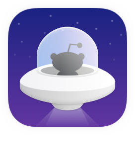
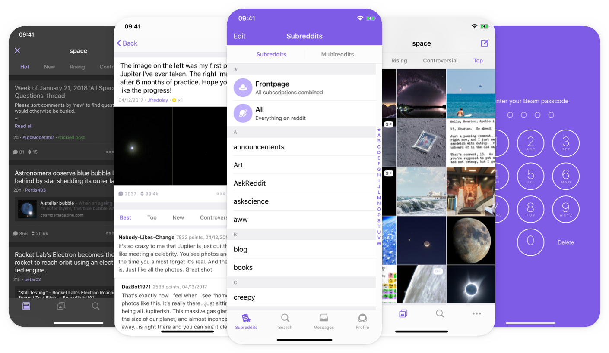

<h1 align="center">
  <br>
  Beam for Reddit<br>
  <p align="center">
    <a href="https://twitter.com/madeawkward">
      
    </a>
    <a href="LICENSE.md">
      
    </a>
  </p>
</h1>

<p align="center">An open source Reddit client for iOS.</p>

<br>
<br>

<p align="center">
  
</p>

<br>

## Introduction

Hi, we're [Awkward](https://awkward.co/). In 2014, we started working on a Reddit client called Beam. In the years that followed, we created a client that lets its users enjoy all of Reddit's content in a unique and beautiful package. After four years of development, we've decided to open source Beam and truly hand it over to its users. We’ll still continue to work on Beam and release high-quality updates.

## Features

Beam brings the best features of Reddit to your iPhone and iPad.

- Multireddits
- Content filters
- In-app messaging
- Message notifications
- Post marking
- Spoiler protection
- 3D Touch

It also offered unlockable packs in the past, now available by default:

- Mediaview
- Night Mode
- Auto Playing GIFs
- Thumbnail Mode
- Metadata Control
- Multiple Accounts
- Passcode Lock
- Touch ID Unlock
- Privacy Mode

## Contributing

### Bug Reports & Feature Requests
Please use GitHub issues to report any bugs or file feature requests. If you can fix it yourself, feel free to send in a pull request.
For any bugs please include the following information:
- The iOS version of the device
- The model of the device (iPhone 5s, iPhone 6 etc)
- If you are running the App Store version of the app or a version that you've compiled yourself
- The fork or branch used if you've compiled the app yourself

### Pull requests

Pull requests should include information about what has been changed. Also, try to include screenshots or links to issues in order to better review the pull request.
All pull requests will be reviewed by someone of the Awkward team.

## Requirements

In order to compile Beam you will need to meet the following requirements:
```
- A Mac with Xcode 8.1 or later
- Git command line tools or a git source control client like Tower. 
```

## Getting started

### Submodules
Beam uses submodules for dependencies, so when cloning Beam, make sure to include recursive submodules. 
If any problems occur trying to checkout these submodules, use the following terminal command to make sure are submodules are ready:
```git submodule update --init --recursive```

### Steps to compile
To compile Beam, please follow these steps: 
1. Clone the repository including submodules
2. Edit `SampleConfig.swift` with the required values and rename it to `Config.swift`
3. Open `beam.xcodeproj` in Xcode
4. Run the app

### General structure of the app

When opening the project in Xcode you will see several targets. The two most important targets are `beam` and `Snoo`. 
- `beam` This is the app that you see on your phone and in the App Store. 
- `Snoo` is the framework built by us that handles the core data objects and communication with the Reddit API. Beam calls snoo to get the data.

## License
Beam is available under the GPL-2.0 license. See the LICENSE.md file for more info.

## Links
- [Awkward](https://awkward.co/)
- [Beam](https://beamreddit.com/)
- [Beam on reddit](https://www.reddit.com/r/beamreddit/)
- [Reddit](https://www.reddit.com/)
